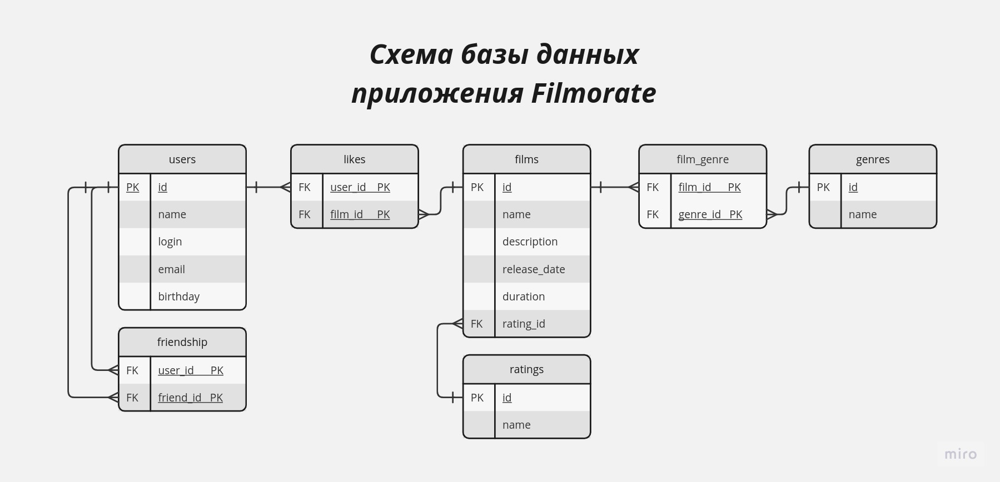

# Проект Filmorate
Репозиторий java-filmorate содержит код для сервиса, который предназначен для работы с фильмами 
и оценками пользователей, а также подготовки списка топ-5 фильмов, рекомендованных к просмотру.
Пользователи сервиса имеют возможность отметить понравившиеся фильмы, познакомиться
с популярными у других пользователей фильмами, завести себе друзей.

Каркас сервиса реализован с использованием Spring Boot.

### Описание схемы базы данных
Хранение данных выполняется в базе данных, имеющей следующую схему:



На диаграмме таблицы users, films, genres и ratings представляют множества сущностей 
для пользователей, фильмов, жанров и рейтингов соответственно. 

Таблица users имеет следующие атрибуты:
* первичный ключ id - идентификатор пользователя сервиса;
* name - имя пользователя;
* login - логин пользователя;
* email - адрес электронной почты пользователя (должен иметь соответствующий формат);
* birthday - дата рождения пользователя.

Атрибуты таблицы films следующие:
* первичный ключ id - идентификатор фильма;
* name - название фильма;
* description - описание фильма;
* release_date - дата выпуска;
* duration - длительность фильма в минутах;
* rating_id - идентификатор рейтинга фильма, который является внешним ключом для связи 
с таблицей ratings.

Атрибуты таблицы genres:
* первичный ключ id - идентификатор жанра;
* name - название жанра.

Таблица ratings имеет следующие атрибуты:
* первичный ключ id;
* name - рейтинг MPA (Ассоциации кинокомпаний).

Таблица friendship реализует связь между пользователями, являющимися друзьями или когда один
предлагает дружбу другому (внешние ключи user_id и friend_id представляют идентификаторы 
соответствующих пользователей, причем когда пользователь предлагает дружбу, он вносится в поле
user_id, а кому предлагают дружбу - в friend_id). Автоматический первичный ключ id используется 
во время создания таблицы.

Таблица likes реализует связь, указывающую на проставление пользователем лайка понравившемуся
фильму. Для связи используются идентификаторы пользователя(user_id) и фильма(film_id), 
являющиеся внешними ключами. Идентификаторы user_id и film_id являются составным первичным ключом 
таблицы likes.

Для реализации связи между фильмами и жанрами используется таблица film_genre. Атрибуты 
с идентификаторами фильма(film_id) и жанра(genre_id) являются внешними ключами. Идентификаторы 
film_id и genre_id являются составным первичным ключом таблицы film_genre.

### Примеры SQL запросов для обращения к базе данных
Для получения информации о пользователе по идентификатору может использоваться 
следующий запрос:
```
SELECT *
FROM user
WHERE user_id=id
```

Чтобы получить список всех пользователей:
```
SELECT *
FROM user
```
Аналогичные запросы выполняются для получения сведений о фильмах.

